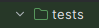
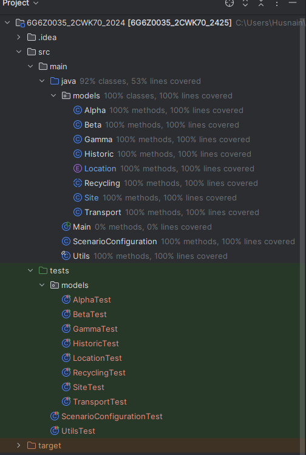
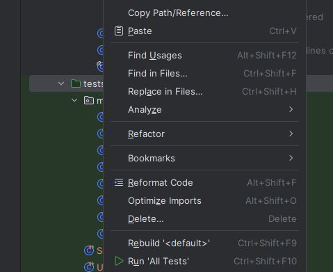
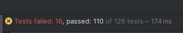

# 6G6Z0035: Software Testing & Quality Assurance

## Project Overview
This repository contains the Landfill Labs Waste Management System, developed by Four Walls Software for The Council. 
It is a user-friendly program that will allow the council to be more efficient when managing and disposing of any recyclable waste from historic landfill sites.
It allows different waste management scenarios to be configured, model these scenarios accordingly, and output results that The Council can use to empty historic landfill sites.

## Important Note for Assessors
For the purposes of this assignment, the test files are the primary focus.

## Test Files
All relevant test files are located in the /tests directory. 

All tests can be run by right clicking the green test file and clicking 'Run all tests' or ctrl + shift + f10.

100% test coverage has been achieved for all files besides the main file which is covered by manual testing.

## More on tests

There are 126 tests. 109 of these pass, 17 of these fail and will be addressed in my defect report.